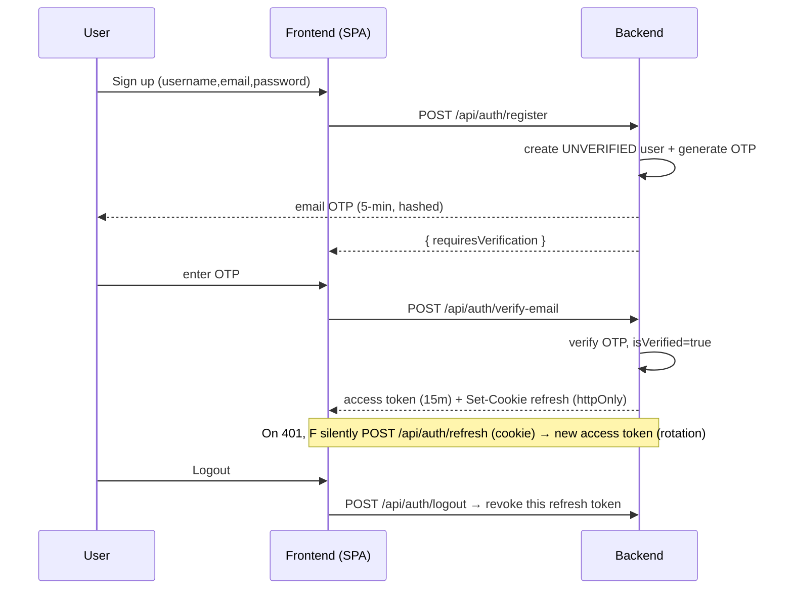
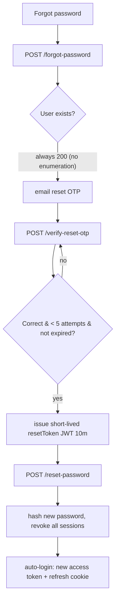
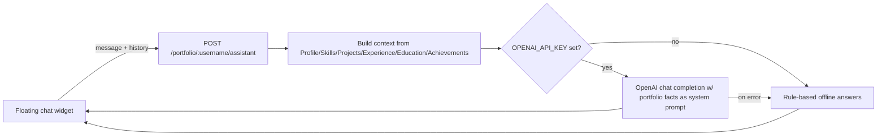

# Architecture

Full-stack multi-user portfolio publisher. Each account owns an isolated
portfolio served at `/u/:username`, manageable from an admin dashboard.

## Stack
- **Frontend:** React 18 + Vite + Tailwind (CSS-variable theme engine), React Router (lazy routes), framer-motion, three.js / @react-three/fiber (3D backgrounds), react-helmet-async (SEO).
- **Backend:** Node + Express, Mongoose, JWT (access) + rotating refresh tokens, nodemailer, OTP, rate limiting, helmet, mongo-sanitize.
- **DB:** MongoDB.
- **Infra:** Docker + docker-compose, GitHub Actions CI, nginx (SPA + API proxy).

## Folder structure
```
portfolio-project/
├── backend/
│   ├── config/db.js              # single DB connection
│   ├── controllers/              # auth, profile, crud, portfolio, analytics, assistant
│   ├── middleware/               # auth, validate, rateLimiters, resolveUser, upload
│   ├── models/                   # User, Profile, content models, Otp, LoginActivity,
│   │                             #   Visit, ContactMessage, ResumeDownload, ThemeEvent
│   ├── routes/                   # /api/* routers
│   ├── utils/                    # otp, token, device, email
│   ├── tests/                    # auth + api flow tests (in-memory Mongo)
│   └── server.js
├── frontend/
│   └── src/
│       ├── components/  (common, admin, layout, three)
│       ├── context/     (Auth, Theme, Background)
│       ├── hooks/       (useTypewriter)
│       ├── pages/       (Landing, PortfolioLayout, Home, Projects, Education, admin/*)
│       └── services/api.js
├── docker-compose.yml
└── .github/workflows/ci.yml
```

## Database schema (high level)
```
User { username*, email*, password(hashed), isVerified, role,
       refreshTokens[{tokenHash,device,ip,expiresAt}], passwordChangedAt, lastLoginAt }
Profile { user→User (1:1), name, title, about, email, phone, location,
          profileImage, resumeUrl, social{}, domains[] }
Projects/Skills/Experience/Education/Achievements/Activities { user→User, ... }
Otp { email, user, codeHash, purpose(verify|reset), attempts, lastSentAt, expiresAt(TTL) }
LoginActivity { user, email, event, ip, device, browser, os, reason }
Visit { user, path, referrer, ip, device }   ResumeDownload { user, ip, device }
ContactMessage { user, name, email, message, read }   ThemeEvent { user, theme }
```
Every content document carries a `user` ref and all queries are ownership-scoped.

## Authentication flow


## OTP / password-reset flow

Security: OTP hashed (HMAC), 5-min TTL, max 5 attempts, 60s resend cooldown,
rate limiting, audit logging via LoginActivity.

## AI assistant architecture

The assistant only answers from the owner's portfolio data and never exposes
secrets. Offline mode means the chatbot works with zero external dependencies.

## Theme & 3D background engine
- 10 palettes defined as CSS variables (`--c-primary-*`); Tailwind maps
  `primary`/`accent` to them, so the whole app recolours when `data-theme`
  changes on `<html>`.
- 6 selectable WebGL backgrounds (particles, neural, galaxy, grid, spheres,
  waves) lazy-loaded via React.lazy; automatic CSS-gradient fallback on
  low-end devices / `prefers-reduced-motion`.
